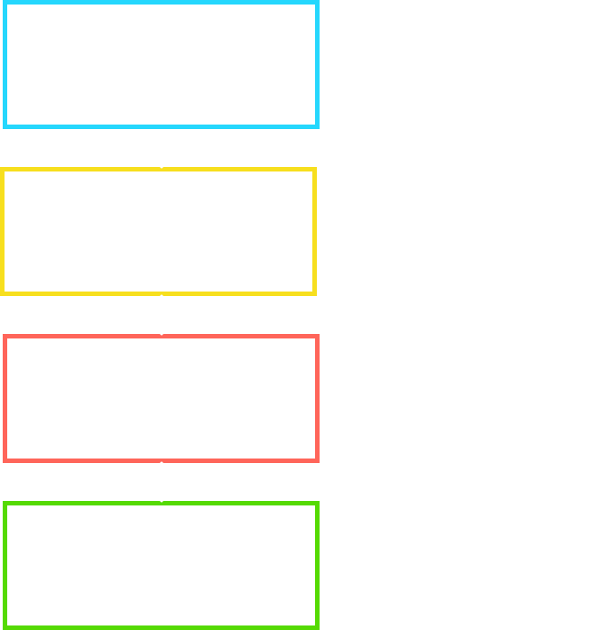
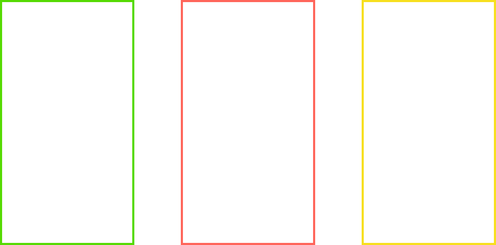
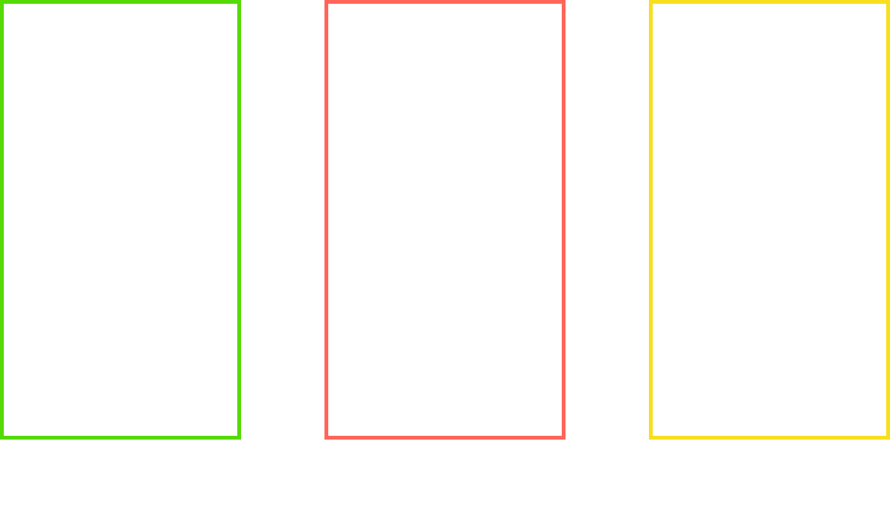
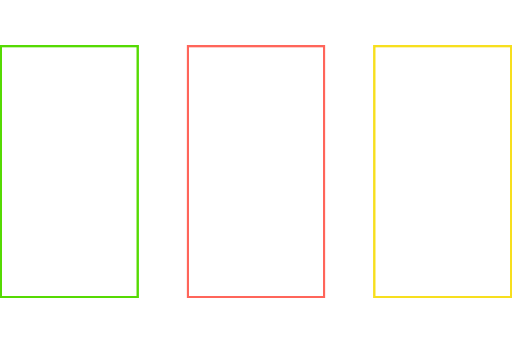
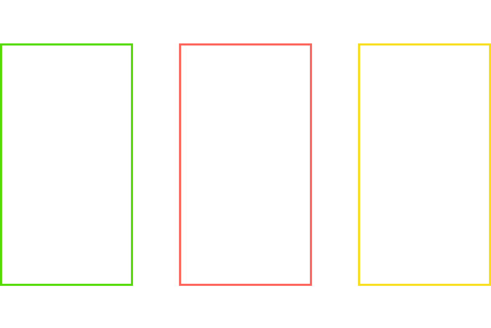
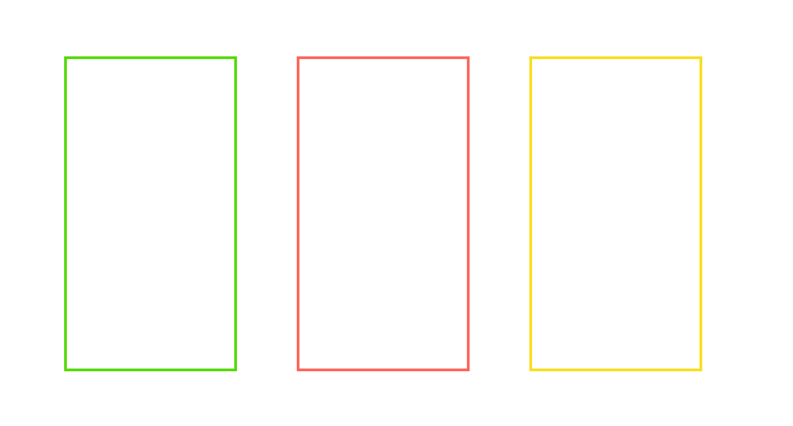
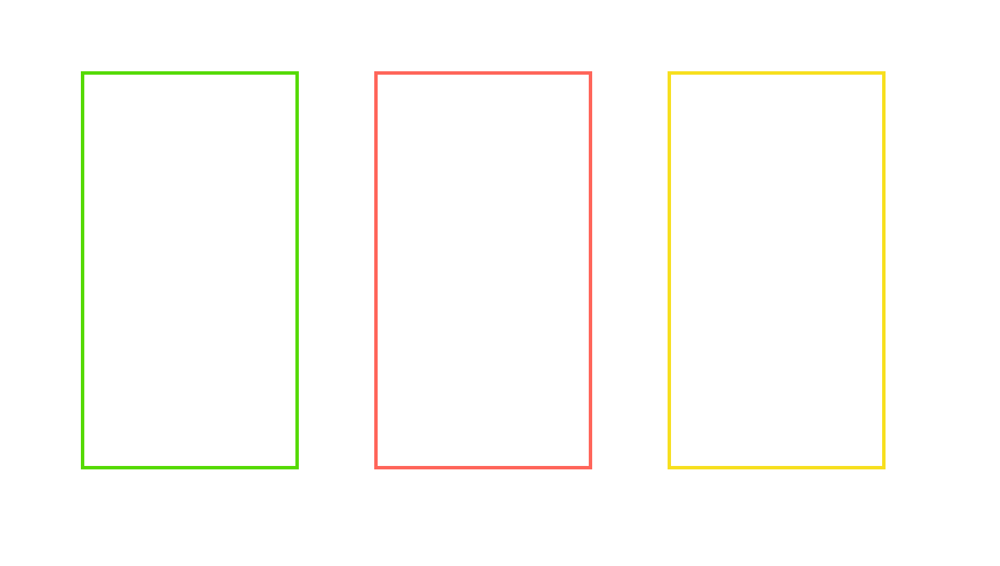
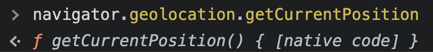
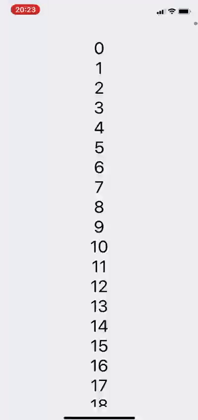
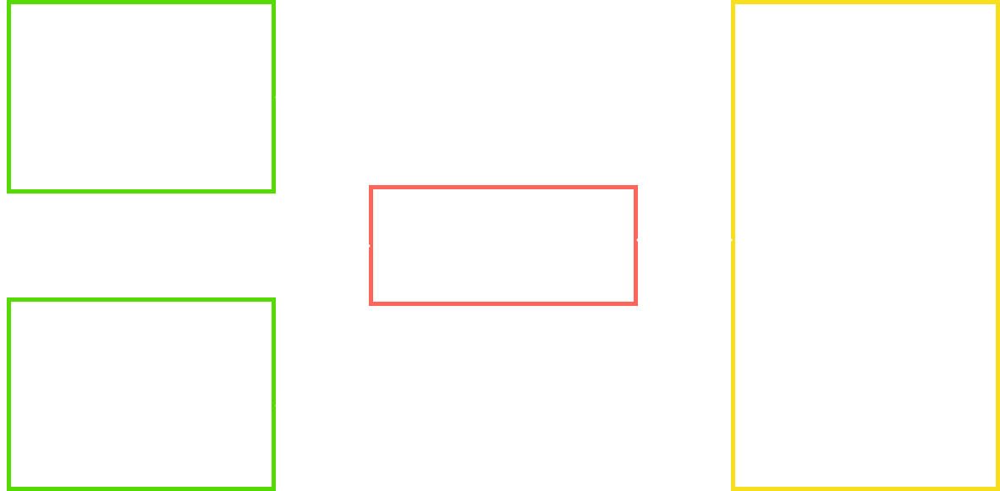

import { Head, Image, Appear } from "mdx-deck";
import Code from "mdx-code";
import { CodeSurfer } from "mdx-deck-code-surfer";

export { default as theme } from "./theme";

import { Intro } from "./Intro";
import { Cover } from "./Cover";
import { Patreon } from "./Patreon";
import { Thanks } from "./Thanks";

import { Img } from "./Img";

<Head>
  <title>RN Architecture in 2021</title>
</Head>

<Cover />

---

<Intro />

---

## Overview

<ul>
  <Appear>
    <li>Javascript Interface (JSI)</li>
    <li>Turbo Modules</li>
    <li>Codegen</li>
    <li>Fabric</li>
  </Appear>
</ul>

---

## Current Architecture

---

## React "Native"

<ul>
  <Appear>
    <li>Native Components</li>
    <li>Native Modules</li>
  </Appear>
</ul>

---

  <CodeSurfer
    title="Native Component: Color View"
    code={require("!raw-loader!./ColorViewManager.java")}
    showNumbers={false}
    dark={true}
    lang="java"
    steps={[{ range: [1, 20], notes: "ColorViewManager.java" }]}
  />

---

  <CodeSurfer
    title="Native Component: Color View"
    code={require("!raw-loader!./ColorPackage.java")}
    showNumbers={false}
    dark={true}
    lang="java"
    steps={[
      { range: [1, 11], notes: "ColorPackage.java" },
      { range: [7, 10], notes: "ColorPackage.java" },
    ]}
  />

---

  <CodeSurfer
    title="Native Component: Color View"
    code={require("!raw-loader!./ColorApp.js")}
    showNumbers={false}
    dark={true}
    lang="javascript"
    steps={[
      { range: [1, 3], notes: "App.js" },
      { range: [5, 11], notes: "App.js" },
    ]}
  />

---

  <CodeSurfer
    title="Native Module: Sum"
    code={require("!raw-loader!./SumModule.java")}
    showNumbers={false}
    dark={true}
    lang="java"
    steps={[{ range: [1, 19], notes: "SumModule.java" }]}
  />

---

  <CodeSurfer
    title="Native Module: Sum"
    code={require("!raw-loader!./SumPackage.java")}
    showNumbers={false}
    dark={true}
    lang="java"
    steps={[
      { range: [1, 11], notes: "ColorPackage.java" },
      { range: [2, 7], notes: "ColorPackage.java" },
    ]}
  />

---

  <CodeSurfer
    title="Native Module: Sum"
    code={require("!raw-loader!./SumApp.js")}
    showNumbers={false}
    dark={true}
    lang="javascript"
    steps={[
      { range: [1, 3], notes: "App.js" },
      { range: [5, 11], notes: "App.js" },
    ]}
  />

---

## Threads

---

## Threads

---

## Threads

---

## Threads

## 

---

## Threads

---

## Threads

---

## Problems

<ul>
  <Appear>
    <li>Asynchronous</li>
    <li>Serialized</li>
    <li>A lot of Layers</li>
  </Appear>
</ul>

---

## Turbo Modules

Is the new generation of React Native Modules. It aims to work with native functions like browsers,
exposing native functions using JSI and improving module performances.

---

## Browser Native Function

---

## Javascript Interface (JSI)

JSI is an engine-independent API to interact with Javascript from C++.
It allows to call functions and hold references on these two languages,
without the need for any serialization.

---

  <CodeSurfer
    title="Sum Module Header (Objective-C++)"
    code={require("!raw-loader!./Sum.h")}
    showNumbers={false}
    dark={true}
    lang="objectivec"
    steps={[{ range: [1, 8], notes: "Sum.h" }]}
  />

---

  <CodeSurfer
    title="Sum Module (Objective-C++)"
    code={require("!raw-loader!./Sum.mm")}
    showNumbers={false}
    dark={true}
    lang="objectivec"
    steps={[
      { range: [1, 29], notes: "Sum.mm" },
      { range: [1, 4], notes: "Sum.mm" },
      { range: [6, 15], notes: "Sum.mm" },
      { range: [17, 24], notes: "Sum.mm" },
      { range: [17, 29], notes: "Sum.mm" },
    ]}
  />

---

  <CodeSurfer
    title="Sum Module Header (C++)"
    code={require("!raw-loader!./react-native-sum.h")}
    showNumbers={false}
    dark={true}
    lang="cpp"
    steps={[{ range: [1, 4], notes: "react-native-sum.h" }]}
  />

---

  <CodeSurfer
    title="Sum Module (C++)"
    code={require("!raw-loader!./react-native-sum.cpp")}
    showNumbers={false}
    dark={true}
    lang="cpp"
    steps={[
      { range: [1, 28], notes: "react-native-sum.cpp" },
      { range: [1, 4], notes: "react-native-sum.cpp" },
      { range: [6, 28], notes: "react-native-sum.cpp" },
      { range: [8, 8], notes: "react-native-sum.cpp" },
      { range: [9, 9], notes: "react-native-sum.cpp" },
      { range: [10, 10], notes: "react-native-sum.cpp" },
      { range: [11, 20], notes: "react-native-sum.cpp" },
      { range: [22, 23], notes: "react-native-sum.cpp" },
      { range: [27, 27], notes: "react-native-sum.cpp" },
    ]}
  />

---

  <CodeSurfer
    title="Sum Module (Javascript)"
    code={require("!raw-loader!./SumAppCxx.js")}
    showNumbers={false}
    dark={true}
    lang="javascript"
    steps={[{ range: [1, 7], notes: "App.js" }]}
  />

---

## Libraries implemented using JSI

- [react-native-reanimated] (https://github.com/software-mansion/react-native-reanimated)
- [react-native-vision-camera] (https://github.com/mrousavy/react-native-vision-camera)
- [react-native-mmkv] (https://github.com/mrousavy/react-native-mmkv)
- [react-native-quick-sqlite] (https://github.com/ospfranco/react-native-quick-sqlite)

---

## Fabric

Is the new React Native renderer. With Fabric, the UI operations are exposed to
Javascript with JSI. This new UI can create and update native components
passing information without using the bridge.

---

## Current Architecture

---

## ScrollView ASYNC

---

## New Architecture

---

## References

- [The New React Native Architecture Explained] (https://formidable.com/blog/2019/react-codegen-part-1/)
- [David Vacca - The state of React Native] (https://youtu.be/FqMTXagEvHo?list=PLZ3MwD-soTTEOWXU2I8Y8C3AfqvJdn3M_)
- [Parashuram N - React Native's New Architecture] (https://youtu.be/UcqRXTriUVI)
- [Emily Janzer - The New React Native] (https://youtu.be/52El0EUI6D0)
- [React-native JSI module] (https://ospfranco.com/post/2021/02/24/how-to-create-a-javascript-jsi-module/)
- [React Native JSI: Part 1 - Getting Started](https://blog.notesnook.com/getting-started-react-native-jsi/)
- [Bringing the Fabric renderer to the “Facebook” app] (https://www.youtube.com/watch?v=xKOkILSLs0Q&t=3985s)

---

<Patreon />

---

<Thanks />
